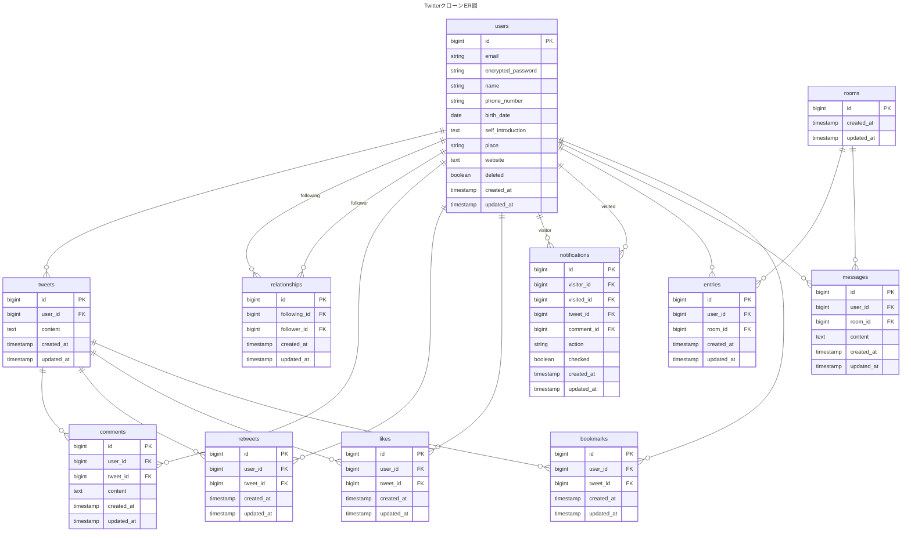

## 概要
本リポジトリは、Ruby on Rails（API モード） を用いて開発した、
Twitter クローンアプリのバックエンド API サーバーです。

フロントエンド（React）と分離した API 専用構成で設計・実装しており、
認証・投稿・通知など、SNS に必要な主要機能を網羅しています。

## 使用技術
- Ruby 3.2.1
- Ruby on Rails 7.0.0
- PostgreSQL 14
- Docker

## 機能一覧
- サインアップ・ログイン(devise_token_auth)
- プロフィール閲覧・編集
- ツイート機能(テキスト&画像)
- いいね
- リツイート
- フォロー
- コメント
- ブックマーク
- メッセージ機能(DM)
- 通知機能
- 退会機能

## 工夫した点
- フロントエンド（React）と完全分離した API 専用構成で設計
- RESTful なエンドポイント設計
- `devise_token_auth` を用いたトークンベース認証の実装
- N+1 問題を考慮したクエリ最適化
- セキュアな認証・認可設計
- 通知機能を汎用的な設計にし、複数アクションへ再利用可能に構築
- DM 機能を会話単位で管理し、将来的な機能拡張を考慮
- 画像投稿に対応したアップロード設計
- Fat Controller を避け、責務を分離した設計
- バリデーションをモデル層に集約し、データ整合性を担保
- Docker を用いた開発環境構築

## ER図

